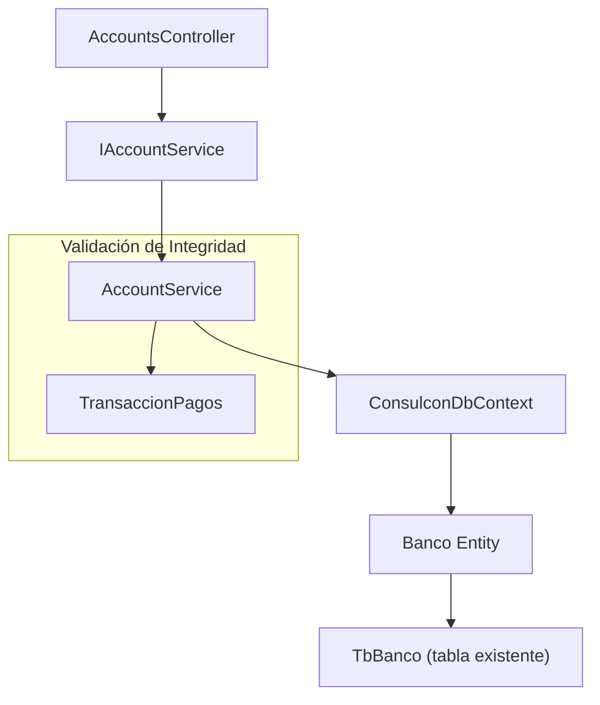

# 02. API de Configuración de Cuentas de Destino y Medios de Pago

**Sprint:** 03
**Tipo:** Addition
**Fecha:** 27/01/2026

## Visión General

Esta API permite al Administrador definir las cuentas donde se recibe el dinero del condominio (Caja Chica, Banco Nacional, etc.). Su propósito es categorizar los ingresos y facilitar la conciliación bancaria futura.

Esta es una **tarea independiente** que sirve como catálogo para que el registro de cobranzas sepa a qué "bolsa" física o virtual entró el dinero.

> [!NOTE]
> Esta implementación **reutiliza la tabla `TbBanco` existente** en la base de datos, por lo que no requiere ninguna migración ni cambio de esquema.

## Entidad Utilizada

### `Banco` (Cuenta Financiera)

Ubicación: `src/Consulcon.Domain/Entities/General/Banco.cs`

- **Propósito**: Representa las cuentas bancarias y de efectivo donde el condominio recibe dinero.
- **Relación DB**: Reside en la base de datos del **Tenant** (cada condominio tiene sus propias cuentas).
- **Tabla**: `TbBanco` (existente)

#### Propiedades Clave:

| Propiedad                  | Tipo    | Descripción                                              |
| -------------------------- | ------- | -------------------------------------------------------- |
| `IdBanco`                  | int     | Identificador único                                      |
| `NombreEntidad`            | string  | Nombre de la cuenta (ej: "Caja Chica", "Banco Nacional") |
| `Tipo`                     | string  | Tipo de cuenta: `"BANCO"` o `"EFECTIVO"`                 |
| `NumeroCuenta`             | string? | Número de cuenta bancaria (opcional)                     |
| `Activo`                   | bool?   | Estado de la cuenta (Activa/Inactiva)                    |
| `Moneda`                   | string? | Moneda de la cuenta                                      |
| `IdCuentaContableAsociada` | int?    | Relación opcional con el Plan de Cuentas                 |

## DTO

Ubicación: `src/Consulcon.Application/DTOs/AccountDto.cs`

```csharp
public class AccountDto
{
    public int Id { get; set; }
    public string Name { get; set; } = string.Empty;       // Mapea a NombreEntidad
    public string Type { get; set; } = "BANCO";            // 'BANCO', 'EFECTIVO'
    public string? AccountNumber { get; set; }             // Mapea a NumeroCuenta
    public bool IsActive { get; set; }                     // Mapea a Activo
}
```

## Controller

Ubicación: `src/Consulcon.API/Controllers/AccountsController.cs`

- Ruta Base: `api/Accounts`

### Endpoints

#### CRUD de Cuentas

| Método   | Ruta                 | Descripción                                    |
| -------- | -------------------- | ---------------------------------------------- |
| `GET`    | `/api/Accounts`      | Listar cuentas (por defecto solo activas)      |
| `GET`    | `/api/Accounts/{id}` | Obtener cuenta por ID                          |
| `POST`   | `/api/Accounts`      | Crear nueva cuenta                             |
| `PUT`    | `/api/Accounts/{id}` | Actualizar cuenta existente                    |
| `DELETE` | `/api/Accounts/{id}` | Eliminar cuenta (con validación de integridad) |

#### Parámetros de Query

| Parámetro    | Tipo | Default | Descripción                                |
| ------------ | ---- | ------- | ------------------------------------------ |
| `activeOnly` | bool | `true`  | Si es `true`, retorna solo cuentas activas |

### Ejemplos de Request/Response

#### GET /api/Accounts?activeOnly=true

**Response (200 OK):**

```json
[
  {
    "id": 1,
    "name": "Caja Chica",
    "type": "EFECTIVO",
    "accountNumber": null,
    "isActive": true
  },
  {
    "id": 2,
    "name": "Banco Nacional",
    "type": "BANCO",
    "accountNumber": "1234567890",
    "isActive": true
  }
]
```

#### POST /api/Accounts

**Request Body:**

```json
{
  "name": "Banco BCP",
  "type": "BANCO",
  "accountNumber": "987654321",
  "isActive": true
}
```

**Response (201 Created):**

```json
3
```

#### DELETE /api/Accounts/{id}

**Response con cobranzas asociadas (400 Bad Request):**

```json
"No se puede eliminar la cuenta porque tiene cobranzas asociadas."
```

## Servicio

Ubicación: `src/Consulcon.Infrastructure/Services/AccountService.cs`

- Implementa `IAccountService` (ubicado en `src/Consulcon.Application/Interfaces/IAccountService.cs`)

### Funcionalidad

1. **GetAllAccountsAsync**: Obtiene todas las cuentas, con filtro opcional por estado activo.
2. **GetAccountByIdAsync**: Obtiene una cuenta por su ID.
3. **CreateAccountAsync**: Crea una nueva cuenta en la base de datos.
4. **UpdateAccountAsync**: Actualiza una cuenta existente.
5. **DeleteAccountAsync**: Elimina una cuenta con **validación de integridad**.

### Validación de Integridad

Antes de eliminar una cuenta, el servicio verifica si existen transacciones de pago (`TransaccionPagos`) asociadas:

```csharp
bool hasPayments = await _context.TransaccionPagos.AnyAsync(t => t.IdBancoDestino == id);
if (hasPayments)
{
    return Result.Fail<bool>("No se puede eliminar la cuenta porque tiene cobranzas asociadas.");
}
```

## Tests

Ubicación: `tests/Consulcon.IntegrationTests/Services/AccountServiceTests.cs`

### Tests Implementados

| Test                              | Descripción                                                |
| --------------------------------- | ---------------------------------------------------------- |
| `CRUD_ShouldWorkCorrectly`        | Verifica el ciclo completo de Create, Read, Update, Delete |
| `Delete_ShouldFail_IfHasPayments` | Verifica que no se puede eliminar una cuenta con cobranzas |
| `GetAll_ShouldFilterActive`       | Verifica que el filtro `activeOnly` funciona correctamente |

Para ejecutar los tests:

```bash
dotnet test tests/Consulcon.IntegrationTests/Consulcon.IntegrationTests.csproj --filter "FullyQualifiedName~AccountServiceTests"
```

## Registro de Dependencias

La inyección de dependencias está configurada en `src/Consulcon.Infrastructure/DependencyInjection.cs`:

```csharp
// Accounts (Configuration)
services.AddScoped<IAccountService, Services.AccountService>();
```

## Criterios de Aceptación ✅

| Criterio                                                       | Estado | Notas                                               |
| -------------------------------------------------------------- | ------ | --------------------------------------------------- |
| CRUD funcional para gestionar las cuentas del condominio       | ✅     | Implementado en `AccountsController`                |
| No se puede eliminar una cuenta con cobranzas asociadas        | ✅     | Validación en `AccountService.DeleteAccountAsync()` |
| La API retorna solo las cuentas activas para el flujo de cobro | ✅     | Parámetro `activeOnly=true` por defecto             |
| Sin cambios en esquema de base de datos                        | ✅     | Reutiliza tabla `TbBanco` existente                 |

## Arquitectura



## FAQ Técnico

### 1. ¿Por qué se usa la tabla `TbBanco` en lugar de crear una tabla nueva?

La tabla `TbBanco` ya existe en el sistema legado y contiene exactamente los campos necesarios para esta funcionalidad. Reutilizarla evita:

- Migraciones de base de datos
- Duplicación de datos
- Romper integridad referencial con otras tablas (`Egresos`, `TransaccionPagos`)

### 2. ¿Las cuentas pertenecen al condominio?

Sí. Al usar el header `X-Tenant-Id`, el sistema se conecta a la base de datos del condominio correspondiente, asegurando que cada condominio solo ve y gestiona sus propias cuentas.

### 3. ¿Cómo se usa esta API en el flujo de cobranzas?

Cuando se registra una cobranza, se debe especificar el `IdBancoDestino` para indicar en qué cuenta entró el dinero. Esta API proporciona el catálogo de cuentas disponibles para seleccionar.
