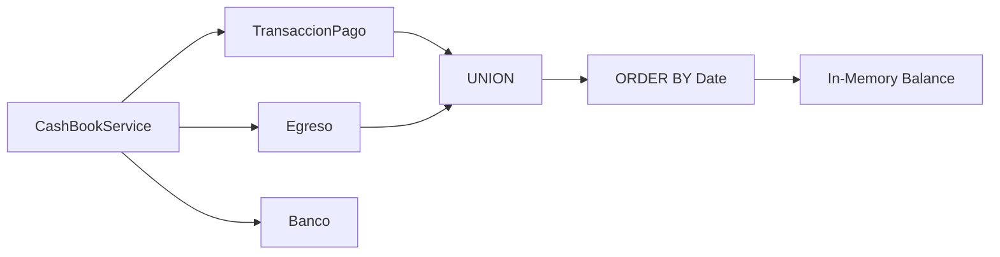

# 11. Motor del Libro de Caja (Cash Book Engine)

**Sprint:** 03  
**Tipo:** Addition  
**Fecha:** 05/02/2026

---

## Visión General

El Motor del Libro de Caja consolida automáticamente los **ingresos** (cobranzas) y **egresos** (pagos) para generar un reporte financiero unificado. Permite al Administrador verificar el saldo real de cualquier cuenta financiera en cualquier momento.

### Características principales:

- **Vista unificada**: Combina `TransaccionPago` (IN) y `Egreso` (OUT) ordenados cronológicamente.
- **Saldo acumulado**: Calcula el balance running de cada movimiento.
- **Paginación inteligente**: Mantiene el rastro del saldo acumulado entre páginas.
- **Movimientos anulados**: Excluye del cálculo matemático pero muestra visualmente (tachados) si `includeVoided=true`.

> [!NOTE]
> Esta implementación reutiliza las entidades existentes `TransaccionPago` y `Egreso` sin crear nuevas tablas.

---

## Nuevos DTOs

Ubicación: `src/Consulcon.Application/DTOs/Contabilidad/CashBook/`

### `CashBookQuery` (Query Object)

| Propiedad            | Tipo       | Descripción                                |
| :------------------- | :--------- | :----------------------------------------- |
| `StartDate`          | `DateTime` | Fecha inicial del reporte (requerido).     |
| `EndDate`            | `DateTime` | Fecha final del reporte (requerido).       |
| `FinancialAccountId` | `int?`     | Filtrar por cuenta bancaria (opcional).    |
| `IncludeVoided`      | `bool`     | Incluir anulados visualmente (def: false). |
| `Page`               | `int`      | Número de página (def: 1).                 |
| `PageSize`           | `int`      | Registros por página (def: 50).            |

### `CashBookEntryDto` (Movimiento)

| Propiedad     | Tipo       | Descripción                             |
| :------------ | :--------- | :-------------------------------------- |
| `Id`          | `int`      | ID del movimiento.                      |
| `Type`        | `string`   | "IN" (ingreso) o "OUT" (egreso).        |
| `Date`        | `DateTime` | Fecha del movimiento.                   |
| `Description` | `string`   | Concepto o descripción.                 |
| `Reference`   | `string?`  | Número de comprobante/factura.          |
| `Amount`      | `decimal`  | Monto (+IN, -OUT).                      |
| `Balance`     | `decimal`  | Saldo acumulado después del movimiento. |
| `AccountName` | `string`   | Nombre de la cuenta.                    |
| `AccountId`   | `int`      | ID de la cuenta.                        |
| `IsVoided`    | `bool`     | Si está anulado.                        |

### `CashBookResultDto` (Resultado)

| Propiedad        | Tipo                     | Descripción                     |
| :--------------- | :----------------------- | :------------------------------ |
| `InitialBalance` | `decimal`                | Saldo antes de `StartDate`.     |
| `FinalBalance`   | `decimal`                | Saldo al final de la página.    |
| `Entries`        | `List<CashBookEntryDto>` | Lista de movimientos.           |
| `TotalRecords`   | `int`                    | Total de registros en el rango. |
| `Page`           | `int`                    | Página actual.                  |
| `PageSize`       | `int`                    | Tamaño de página.               |
| `TotalPages`     | `int`                    | Total de páginas (calculado).   |

---

## Nuevo Controller

Ubicación: `src/Consulcon.API/Controllers/Contabilidad/CashBookController.cs`

- Ruta Base: `api/cashbook`

### Endpoints

| Método | Ruta            | Descripción                                        |
| :----- | :-------------- | :------------------------------------------------- |
| `GET`  | `/api/cashbook` | Obtiene el libro de caja con filtros y paginación. |

#### Parámetros Query

```
GET /api/cashbook?startDate=2026-01-01&endDate=2026-01-31&financialAccountId=1&includeVoided=true&page=1&pageSize=50
```

#### Respuesta Exitosa (200 OK)

```json
{
  "initialBalance": 5000.0,
  "finalBalance": 4350.0,
  "entries": [
    {
      "id": 101,
      "type": "IN",
      "date": "2026-01-05T10:30:00Z",
      "description": "Cobranza Unidad 101 - Marzo 2026",
      "reference": "TRX-12345",
      "amount": 500.0,
      "balance": 5500.0,
      "accountName": "Banco Nacional",
      "accountId": 1,
      "isVoided": false
    },
    {
      "id": 45,
      "type": "OUT",
      "date": "2026-01-10T14:00:00Z",
      "description": "Pago servicio de limpieza",
      "reference": "F-999",
      "amount": -150.0,
      "balance": 5350.0,
      "accountName": "Banco Nacional",
      "accountId": 1,
      "isVoided": false
    }
  ],
  "totalRecords": 125,
  "page": 1,
  "pageSize": 50,
  "totalPages": 3
}
```

---

## Servicios

Ubicación: `src/Consulcon.Infrastructure/Services/Contabilidad/CashBookService.cs`

- Implementa `ICashBookService`.
- **Funcionalidad**: Genera el libro de caja consolidando ingresos y egresos.

### Algoritmo de procesamiento

1. **Calcular InitialBalance**: `Sum()` de transacciones anteriores a `StartDate`.
2. **Unificar movimientos**:
   - `TransaccionPago` donde `Estado == "CONFIRMADO"` → Type = "IN", Amount = +MontoAbonado
   - `Egreso` → Type = "OUT", Amount = -MontoTotal
3. **Ordenar por fecha** ascendente.
4. **Calcular saldo running** (In-Memory):
   - Solo movimientos no anulados afectan el cálculo.
5. **Aplicar paginación** preservando el saldo inicial de la página.

### Interacción DB



---

## Tests

Ubicación: `tests/Consulcon.IntegrationTests/Services/CashBookServiceTests.cs`

| Test                                                              | Descripción                                               |
| :---------------------------------------------------------------- | :-------------------------------------------------------- |
| `GetCashBook_ShouldCalculateCorrectBalance_WithMixedTransactions` | Valida cálculo correcto con ingresos y egresos mezclados. |
| `GetCashBook_ShouldExcludeVoidedFromCalculation`                  | Movimientos anulados no afectan el saldo.                 |
| `GetCashBook_ShouldFilterByAccount`                               | Filtra correctamente por `FinancialAccountId`.            |
| `GetCashBook_ShouldPaginateCorrectly`                             | Mantiene saldo acumulado entre páginas.                   |
| `GetCashBook_ShouldCompleteIn500ms_For2000Records`                | Performance: < 500ms para 12 meses (~2000 registros).     |

```bash
dotnet test tests/Consulcon.IntegrationTests/Consulcon.IntegrationTests.csproj --filter "FullyQualifiedName~CashBookServiceTests"
```

---

## Postman Collection

**Archivo:** `docs/99 - Otros/02-postman/postman_collection.json`  
**Carpeta:** `Tesorería > Libro de Caja`

### Request: Get Cash Book

| Campo       | Valor                                                              |
| ----------- | ------------------------------------------------------------------ |
| **Nombre**  | Get Cash Book                                                      |
| **Método**  | `GET`                                                              |
| **URL**     | `{{baseUrl}}/api/cashbook?startDate=2026-01-01&endDate=2026-01-31` |
| **Headers** | `Authorization: Bearer {{authToken}}`, `X-Tenant-Id: {{tenantId}}` |

---

## Criterios de Aceptación

| Criterio                                                    | Estado | Notas                              |
| :---------------------------------------------------------- | :----- | :--------------------------------- |
| Paginación sin perder rastro del saldo acumulado            | ⏳     | Implementar con InitialBalance.    |
| Tiempo de respuesta < 500ms para 12 meses (~2000 registros) | ⏳     | Verificar con test de performance. |
| Movimientos anulados excluidos del cálculo matemático       | ⏳     | `IsVoided` no afecta Balance.      |
| Movimientos anulados visibles (tachados) si `includeVoided` | ⏳     | Incluir en respuesta si es true.   |
